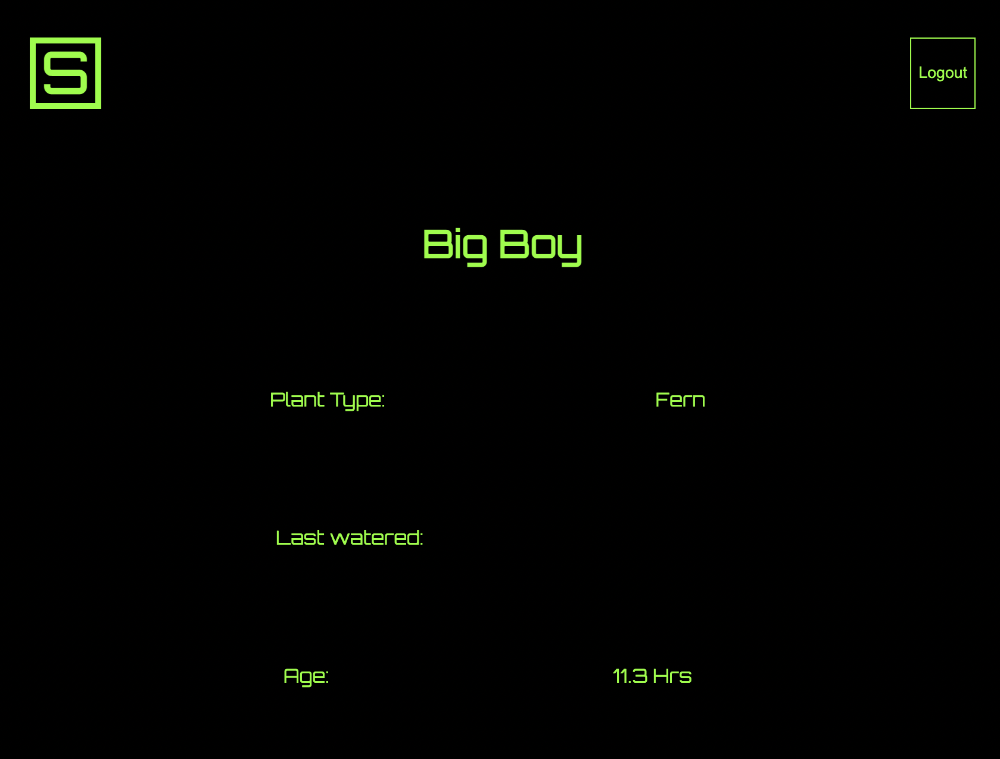

<h2 align="center">The year is 691 BC.</h2>

Sennacherib, King of the Assyrians, has led his last campaign of war, conquering Babylon and bringing riches to his kingdom.  He turned his gaze inward, focused now on growing his wealth and enriching his people with beauty and knowledge.

<h2 align="center"> The Gardens of Nineveh </h2>

Among other spoils of war, plants from far away lands were returned to the capital city of Nineveh. A massive construction project was undertaken, 18 large canals were dug and a massive 65km aqueduct directed life sustaining water from the hills above. The expansion of these gardens continued until the reign of Ashurbanipal II ended around 627 BC. Historians argue that Nineveh is the true location of the Hanging Gardens of Babylon.

<h1 align="center"> SennaBox  </h1>

Build your own garden. SennaBox is a no spill, self watering planter box. Plants in the SennaBox take water and nutrients as they need, just keep the reservoir filled and watch your plants thrive. Not all plants are created equally, so SennaBox can create indiviudual watering schedules for each plant. Bring home living remembrances of your travels, the parts of the world 🌎 that you have conquered.

  </img>

<h2> Requirements: </h2>
<ul>Hardware
  <li><a href="https://www.raspberrypi.org/">Raspberry Pi</a></li>
  <li>5v power supply</li>
  <li>Some wires</li>
  <li><a href="https://www.mouser.com/ProductDetail/Adafruit/4026?qs=0lSvoLzn4L%2Fz8Ax03ybPVA%3D%3D&mgh=1">Soil moisture sensor</a></li>
  <li><a href="https://www.mouser.com/ProductDetail/Adafruit/1150?qs=GURawfaeGuC56yozG16bcg%3D%3D&mgh=1">A pump</a></li>
  <li><a href="https://indoorsun.com/">A plant!!</a></li>
</ul>
<ul>Software
    <li><a href="https://nodejs.org/">NodeJS</a></li>
    <li><a href="https://expressjs.com/">ExpressJS</a></li>
    <li><a href="https://reactjs.org/">React</a></li>
    <li><a href="https://recoiljs.org/">Recoil</a></li>
    <li><a href="https://www.postgresql.org/">PostgreSQL</a></li>
    <li><a href="https://sequelize.org/">Sequelize</a></li>
    <li><a href="https://www.raspberrypi.org/">Raspberry Pi</a></li>
</ul>
  
 
<h2>Instructions:</h2>
<h4>For now, the GPIO runs in mock mode on the raspberry pi</h4>
<ol>
  <li><strong>git clone</strong> the repository onto a Raspberry Pi 3+ or higher</li>
  <li>From root directory, run <strong>npm i --save</strong></li>
  <li>Navigate to frontend folder and install <strong>cd frontend && npm i --save</strong></li>
  <li>ADD .ENV FOLDER IN ROOT AND SERVER (see sample.env.txt (yet to do) )</li>
  <li>From root folder, run <strong>npm start</strong></li>
  <li>Navigate to 127.0.0.1:3000 and start monitoring a plant!!</li>
</ol>

<h2>Contribute</h2>

If you would like to contribute to SennaBox, please clone the repo, push your changes and make a pull request <a href="https://github.com/jazznerd206/SennaBox/pulls">here</a>. I'm open to any and all help!

